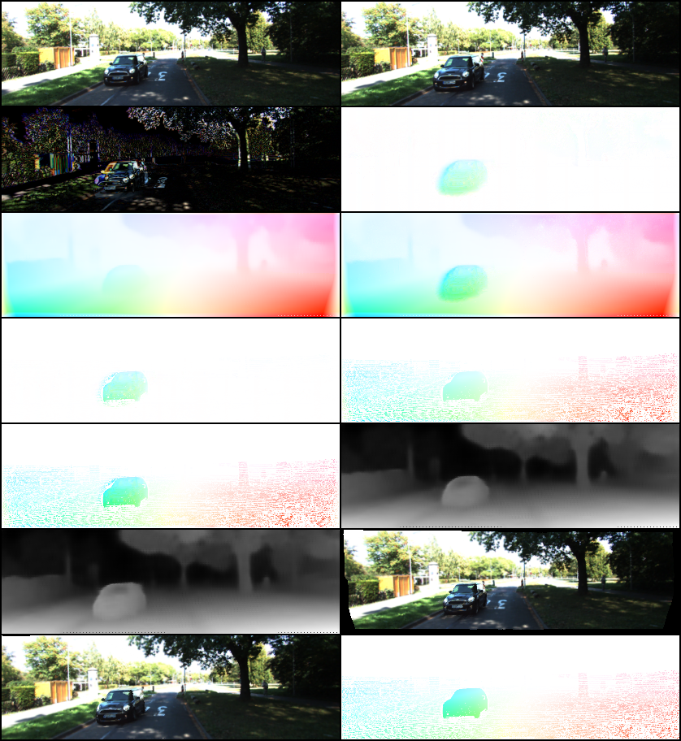

# Pytorch implementation of Unsupervised Monocular Depth Learning in Dynamic Scenes

This is an unofficial Pytorch implementation of the paper [Unsupervised Monocular Depth Learning in Dynamic Scenes](https://arxiv.org/pdf/2010.16404.pdf) by Hanhan Li et.al.

<p align="center">
  
</p>
From left to right, top to bottom: 

1. image_1, image_2, 
2. abs(image 1 - image 2), residual flow
3. background_flow, total_flow
4. residual flow masked, background_flow masked
5. total_flow masked, predicted depth image_1
6. predicted depth image_2, warped image_2 -> image_1
7. warped image_1 -> image_2, ground truth flow.

## Requirements
This implementation was tested with the latest version of pytorch and pytorch-lightning. This is also integrated with wandb for logging and visualization. The requirements can be installed using the following command:
```
pip install -r requirements.txt
```

## Dataset
This implementation uses the KITTI 2015 raw dataset for training and validation. Additionally, we also use the KITTI Flow 2015 dataset for testing purposes.

### KITTI Raw Dataset
We followed the procedure to fetch the KITTI data as mentioned in the [Monodepth2](https://github.com/nianticlabs/monodepth2/tree/master) repository.

To get started, download the KITTI raw 2015 dataset from [here](https://www.cvlibs.net/datasets/kitti/eval_scene_flow.php?benchmark=stereo).
Unzip the dataset and make sure there is enough space on your disk. The dataset is around 175 GB in size. The images are in png format. We convert it to jpg format and train our model. Alternatively, you can also train the model with png images. Change `img_ext` to `png` in config yaml file to train models.

Example path should look something like this.
```<KITTI_DATA_ROOT>/2011_09_26/2011_09_26_drive_0001_sync/image_02/data/ 0000000000.png```

### KITTI Flow Dataset
Download the KITTI flow 2015 dataset from [here](https://www.cvlibs.net/datasets/kitti/eval_scene_flow.php?benchmark=flow).
The KITTI flow dir should contain the following folders:
```
data_scene_flow_multiview 
devkit
testing 
training
```

## Training
To train the model, fill in the `???` values in `config.yaml` file. Run
```
HYDRA_FULL_ERROR=1 python run.py --config-name config.yaml
```

Alternatively, you can define the values of config file in the command line itself
```
HYDRA_FULL_ERROR=1 python run.py --config-name config.yaml \
    mode=training \
    dataset.kitti.path=<path_to_kitti_raw_dataset> \
    dataset.kitti_flow_path=<path_to_kitti_flow_dataset> \
    exp_manager.exp_dir=<path_to_save_checkpoints>
```

## Testing
To test the model, change `mode` to `testing` in `config.yaml` file. Alternatively, run
```
HYDRA_FULL_ERROR=1 python run.py --config-name config.yaml \
    mode=testing \
    pretrained_name=<path_to_ckpt_file> \
    dataset.evaluateKITTIFlow=true \
    exp_manager.exp_dir=<path_to_save_results>
    exp_manager.logging.mask_flow=true
```

## Checkpoints
Our trained checkpoint can be found here on the drive link.

## Depth metrics
The depth metrics are calculated on the KITTI 2015 test dataset. The results are as follows:
| Abs Rel | Sq Rel | RMSE | RMSE log | Acc.1 | Acc.2 | Acc.3 |
|---------|--------|------|----------|-------|-------|-------|
| 0.149   | 1.085  | 5.56| 0.234    | 0.801 | 0.929 | 0.970 |

## Acknowledgements
We borrow a lot of code from the following repositories:
- (TF implementation)[https://github.com/google-research/google-research/tree/master/depth_and_motion_learning]
- (Monodepth2)[https://github.com/nianticlabs/monodepth2]
- (Pytorch Depth from videos in wild)[https://github.com/bolianchen/pytorch_depth_from_videos_in_the_wild]